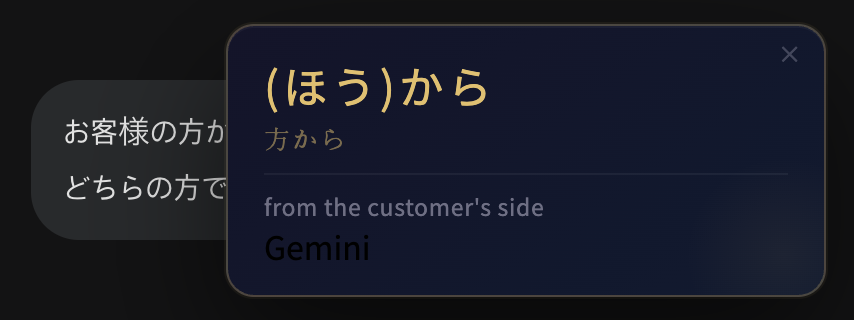

# 漢字 よみがな — Kanji Yomigana

Instant Kanji Reading Chrome Extension that instantly shows the **yomigana (furigana reading)** of any kanji you click on a Japanese webpage, powered by Claude or Gemini AI.

This project was built with the help of AI tools.

## 📸 Demo

---

## ✨ Why this exists

Reading Japanese online is frustrating when kanji readings change depending on context.

This tool solves that — instantly.

---

## Features

- **Click any kanji** on any Japanese page to see its hiragana reading instantly
- **Context-aware readings** — disambiguates kanji with multiple pronunciations (e.g. 方 → ほう or かた) by analyzing surrounding text
- **AI-powered** — choose between Claude (Haiku) or Gemini (2.5 Flash)
- **Multi-language translation** — get the meaning in 22 languages including English, Chinese, Korean, French, Spanish, and more
- **Today's Kanji tab** — grid view of every kanji you looked up today
- **Focus list** — kanji looked up 2+ times within 7 days are automatically collected for intensive review, sorted by frequency
- **ON/OFF toggle** — disable the extension temporarily without losing your settings (useful when you want to copy text freely)
- **Per-item delete** — remove individual entries from Today or Focus lists

---

## Installation

This extension is not published on the Chrome Web Store. Install it manually in developer mode:

1. Download or clone this repository
2. Open Chrome and go to `chrome://extensions`
3. Enable **Developer mode** (top-right toggle)
4. Click **"Load unpacked"** and select the `kanji-yomigana` folder
5. The extension icon will appear in your toolbar

---

## Setup

### Option A — Gemini (Free)

1. Go to [aistudio.google.com/apikey](https://aistudio.google.com/apikey) and generate a free API key
2. Open the extension popup → **Settings** tab
3. Select **Gemini**, paste your key, and click **Save**

> Gemini 2.5 Flash is free up to **1,500 requests/day** — more than enough for daily reading practice.

### Option B — Claude (Paid)

1. Go to [console.anthropic.com](https://console.anthropic.com) and create an API key
2. Open the extension popup → **Settings** tab
3. Select **Claude**, paste your key, and click **Save**

> Uses Claude Haiku for fast, cost-efficient responses.

---

## How It Works

1. Click any kanji or kanji compound on a Japanese page
2. The extension detects the clicked character and extracts the surrounding word
3. If the kanji has ambiguous readings (e.g. 方, 日, 生), the surrounding context is sent to the AI to determine the correct pronunciation
4. A tooltip appears showing:
   - **Large gold text** — hiragana reading with kanji annotated in parentheses, e.g. `(かた)方から`
   - **Small text** — the original word
   - **Gray text** — meaning in your chosen language

---

## Supported Languages

22 languages including English, Korean, Chinese, French, Spanish, etc.

---

## Privacy

- API key stored locally  
- No tracking  
- No data collection 

---

## ☕ Support this project

If this tool saved you time, consider buying me a coffee.

👉 https://paypal.me/shhanseoul/3

---

## License

MIT
